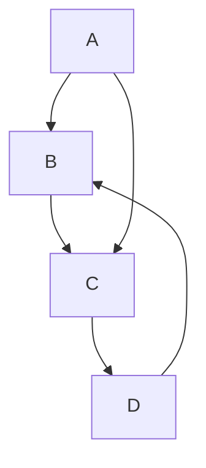
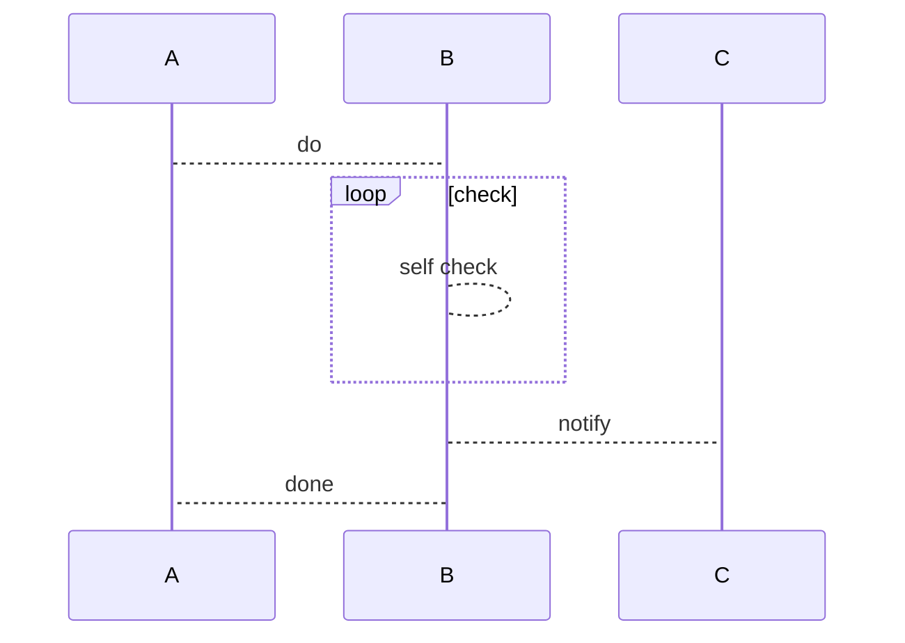
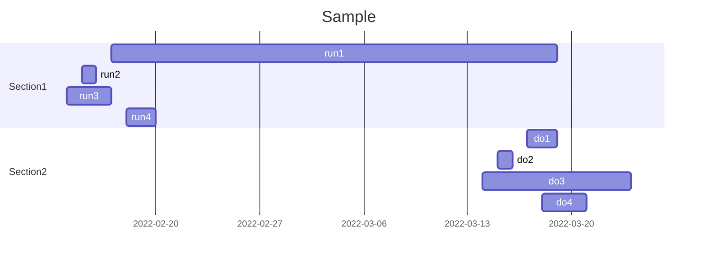
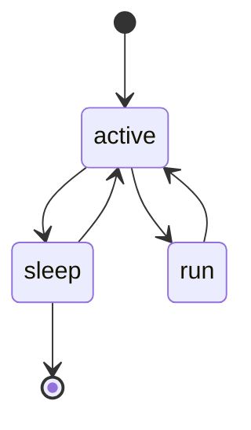

# github-playground

## Workflow

### another repositroy workflow invoker

invoke one repository's GitHub Actions from another repositry.

1. 以下の権限を持った GitHub App を作成する
  - Read and write access to actions
  - Read access to metadata

2. 作成した GitHub App を呼び出される側のリポジトリに install する
3. 呼び出される workflow dispatch workflow を作成する

GitHub Actions によって上記の workflow を呼び出す場合

1. 呼び出し側のリポジトリに上記の GitHub App をインストールする（トークン取得を自作する場合、不要かもしれない）
2. 呼び出される側の workflow を呼び出す workflow を作成する
  - [expample here](./.github/workflows/invoke.yml)

## Mermaid

playground

## Test
