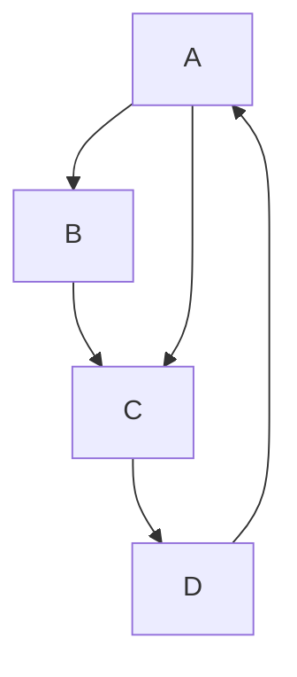
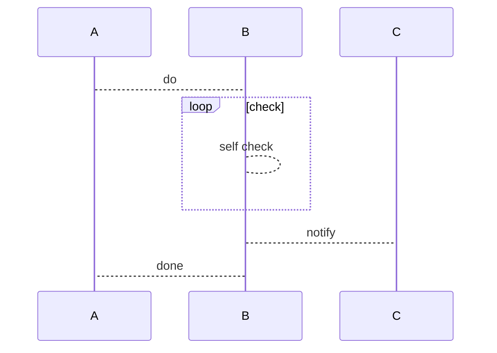
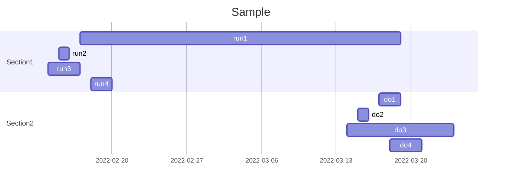
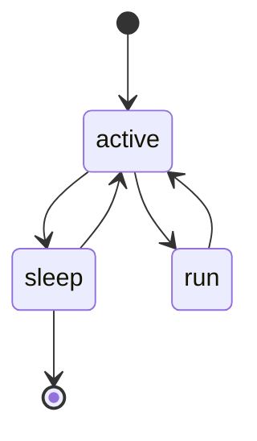

# github-playground
playground

```mermaid
graph TD
  A --> B;
  B --> C;
  A --> C;
  C --> D;
  D --> A;
```

```mermaid
sequenceDiagram
  participant A
  participant B
  
  A --> B: do
  loop check
    B --> B: self check
  end
  B --> C: notify
  B --> A: done
```

``` mermaid
gantt
  title Sample
  section Section1
  run1: a1, 2022-02-17, 30d
  run2: a2, 2022-02-15, 1d
  run3: a3, 2022-02-14, 3d
  run4: a4, 2022-02-18, 2d
  
  section Section2
  do1: b1, 2022-03-17, 2d
  do2: b2, 2022-03-15, 1d
  do3: b3, 2022-03-14, 10d
  do4: b4, 2022-03-18, 3d
```

```mermaid
stateDiagram
  [*] --> active
  active --> sleep
  active --> run
  run --> active
  sleep --> active
  sleep --> [*]
```
